# Qatar Property Rental Management — Phase 2

**Bright Information Systems W.L.L** · Odoo 19 Enterprise  
**Repository:** https://github.com/Bright-Information-Systems/bright_property_rental_phase_2  
**Branch:** `feature/industry-real-estate-workflow-uat`  
**Date:** June 2026

| Item | Value |
|------|--------|
| **Status** | UAT complete — pre-development evidence |
| **Foundation** | Odoo official `industry_real_estate` v19.0.1.3 |
| **Custom module** | `qatar_property_base` — **not created yet** |
| **Phase 1 reference** | https://github.com/Bright-Information-Systems/bright_property_rental_phase_1 |

---

## Executive summary

Qatar Property Phase 2 will be built on **Odoo's official Property Management package** (`industry_real_estate`), not on the Phase 1 `sale_renting` approach.

| Point | Detail |
|-------|--------|
| **Foundation** | Odoo official `industry_real_estate` — buildings, property units, subscription contracts, invoicing |
| **Qatar extension** | `qatar_property_base` will be developed later to add Qatar-specific fields, partner roles, and statutory reports |
| **Current state** | **No custom Odoo module code exists** in this repository |
| **Work completed** | UAT evidence, workflow validation, Playwright screenshots, and technical documentation |

Phase 1 proved that rental workflows can run in Odoo 19. Phase 2 adopts the **stronger official property model** and will extend it for Qatar regulatory and business requirements.

---

## Architecture decision

**Final decision: Option B — Pivot to `industry_real_estate`** (client approved)

| | Phase 1 | Phase 2 foundation |
|---|---------|-------------------|
| **Approach** | Native `sale_renting` | Official `industry_real_estate` |
| **Buildings** | `product.category` | `x_buildings` |
| **Units** | `product.template` | `account.analytic.account` (Properties plan) |
| **Contracts** | `sale.order` (rental flag) | `sale.order` (subscription + property link) |
| **Purpose** | Workflow validation | Production property foundation |

**Why Option B:**

1. **Phase 1 was workflow validation only** — it confirmed rental-to-invoice flows but used product-centric models not designed for property portfolios.
2. **Odoo's official real estate package** provides dedicated buildings, property units, availability gantt, and subscription billing out of the box.
3. **Future Qatar modules** will **extend** the official model (`x_buildings`, analytic property accounts, subscription contracts) rather than reinvent it.

Full analysis: [docs/PHASE_1_5_ARCHITECTURE_DECISION.md](docs/PHASE_1_5_ARCHITECTURE_DECISION.md)

---

## Tested environment

| Item | Value |
|------|--------|
| **Sandbox database** | `qatar_property_industry_uat` |
| **URL** | http://127.0.0.1:9020 |
| **Odoo version** | 19 Enterprise |
| **Source module** | `industry_real_estate` v19.0.1.3 |
| **Phase 1 UAT database** | `qatar_property_phase1_demo` — **not modified** |
| **Automation** | Playwright UAT — [tests/playwright/tests/industry_real_estate_uat.spec.js](tests/playwright/tests/industry_real_estate_uat.spec.js) |

---

## Official workflow

The validated end-to-end business flow in `industry_real_estate`:

```
Properties app
    → Buildings (x_buildings)
    → Property units (account.analytic.account)
    → Tenant / customer (res.partner)
    → Subscription contract (sale.order)
    → Invoice (account.move)
    → Payment wizard / payment status
```

| Step | Odoo model | Menu / action |
|------|------------|---------------|
| 1 | App entry | **Properties** → Rental Contracts |
| 2 | `x_buildings` | Properties → Properties → **Buildings** |
| 3 | `account.analytic.account` | Properties → Properties → **Properties** |
| 4 | `res.partner` | Contacts (customer on contract) |
| 5 | `sale.order` | Properties → **Rental Contracts** |
| 6 | `account.move` | Invoices (from contract / subscription) |
| 7 | `account.payment` | **Pay** button on posted invoice |

Technical detail: [docs/INDUSTRY_REAL_ESTATE_WORKFLOW_ANALYSIS.md](docs/INDUSTRY_REAL_ESTATE_WORKFLOW_ANALYSIS.md)

---

## Use case scenarios

| UC | Scenario | Status |
|----|----------|--------|
| UC-IRE-001 | Open Properties app | **PASS** |
| UC-IRE-002 | Verify buildings (Al Rayyan Tower, Doha Business Center) | **PASS** |
| UC-IRE-003 | Verify 4 property units | **PASS** |
| UC-IRE-004 | Verify tenant Doha Trading LLC | **PASS** |
| UC-IRE-005 | Create subscription contract (S00001) | **PASS** |
| UC-IRE-006 | Generate invoice (INV/2026/00001) | **PASS** |
| UC-IRE-007 | Register payment / payment wizard | **PARTIAL** |
| UC-IRE-008 | Check availability and property views | **PASS** |
| UC-IRE-009 | Qatar gap analysis | **PASS** |

**Summary: 8 PASS · 1 PARTIAL · 0 FAIL**

UC-IRE-007 is **PARTIAL** because the payment wizard opens successfully but payment was not posted in the automated test (to avoid journal side-effects in the shared sandbox). Manual payment registration is supported.

Full test report: [docs/USE_CASES_INDUSTRY_REAL_ESTATE_UAT.md](docs/USE_CASES_INDUSTRY_REAL_ESTATE_UAT.md)

---

## UAT screenshots

Screenshots below are Playwright-captured evidence from sandbox `qatar_property_industry_uat`.  
[View all screenshots →](docs/screenshots/industry_real_estate_uat/)

### UC-IRE-001 — Properties app / Rental Contracts

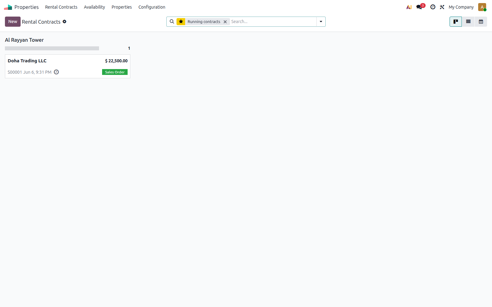

**Proves:** `industry_real_estate` is installed. The **Properties** app opens with **Rental Contracts** as the main view (`sale.order` linked to property units). This is the production entry point for Qatar Phase 2.

---

### UC-IRE-002 — Buildings kanban

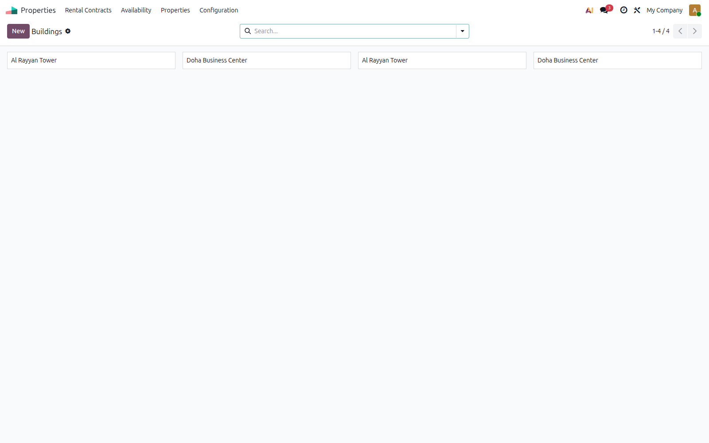

**Proves:** Buildings are managed in model `x_buildings` with a kanban view. Al Rayyan Tower and Doha Business Center are registered as separate building records.

---

### UC-IRE-002 — Building form (Al Rayyan Tower)

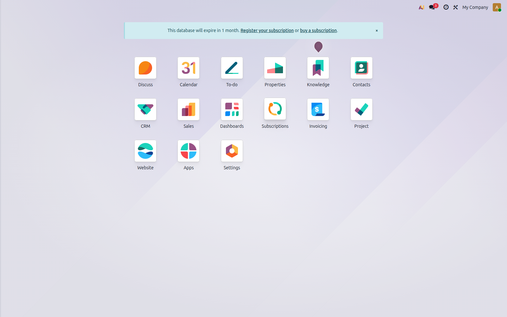

**Proves:** Building form captures name, street, city, ZIP, country, and state. This replaces Phase 1's `product.category` building approach.

---

### UC-IRE-003 — Property units kanban


**Proves:** Four units (Shop G-01, Office 203, Apartment 1204, Kiosk K-05) exist as **Properties** analytic accounts with `x_is_property = True`.

---

### UC-IRE-003 — Shop G-01 unit form

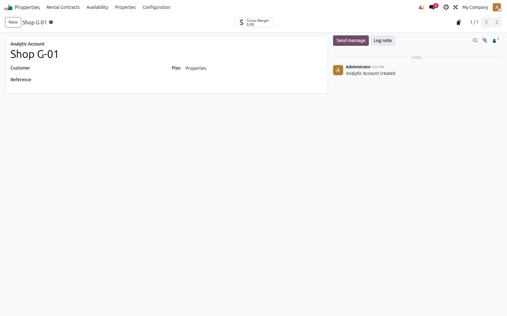

**Proves:** Each unit is an `account.analytic.account` on the **Properties** analytic plan. Extended fields (building, type, address) are available on the industry property form.

---

### UC-IRE-004 — Tenant Doha Trading LLC

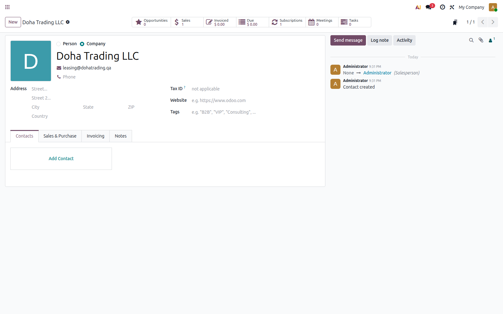

**Proves:** Tenant is a standard `res.partner` company record. It becomes the **Customer** on rental subscription contracts. No separate tenant role field exists yet (gap for `qatar_property_base`).

---

### UC-IRE-005 — Subscription contract S00001

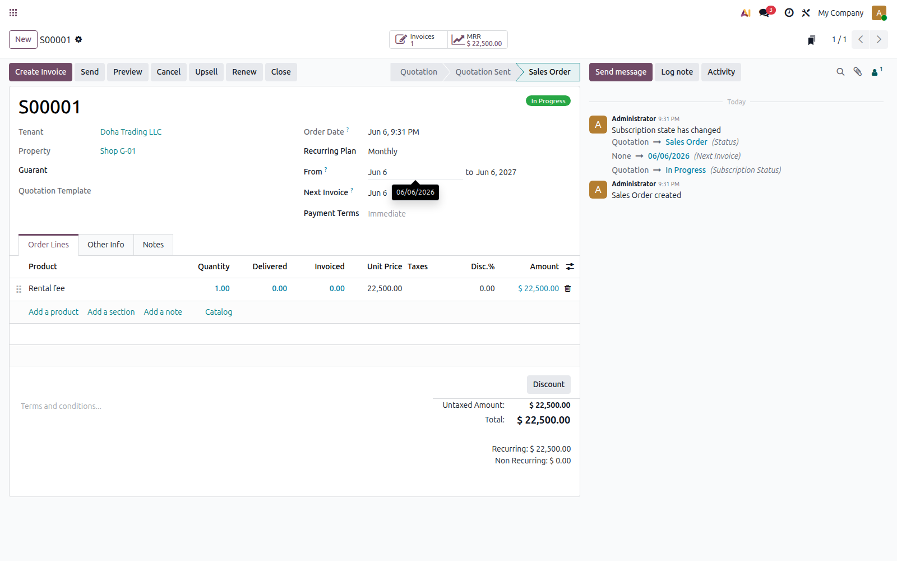

**Proves:** Rental contract is a **subscription** `sale.order` (S00001) linking **Shop G-01** + **Doha Trading LLC**, Monthly plan, 22,500/month, status **In Progress**. MRR and next invoice date are tracked natively.

---

### UC-IRE-006 — Posted invoice INV/2026/00001

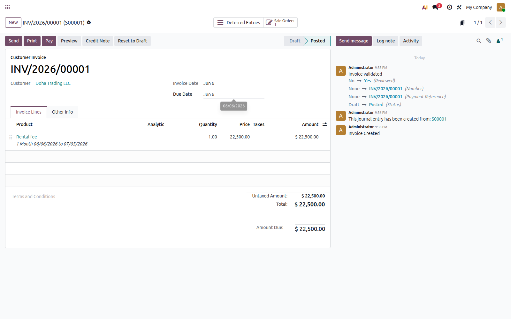

**Proves:** Invoice generated from subscription S00001. Line: *Rental fee* for one month (06/06/2026–07/05/2026), 22,500. Invoice is **posted** and linked back to sale order via `invoice_origin`.

---

### UC-IRE-007 — Payment wizard

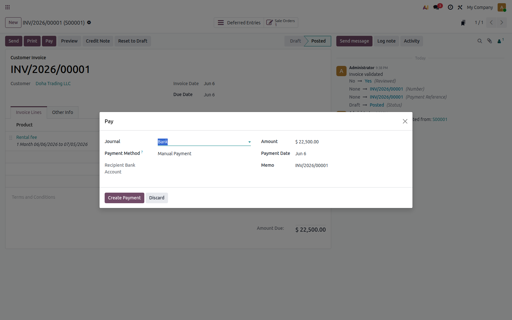

**Proves:** Standard Odoo **Pay** / Register Payment wizard is available on posted invoices. Payment registration is supported; automated test stopped at wizard open (PARTIAL).

---

### UC-IRE-007 — Invoice unpaid status

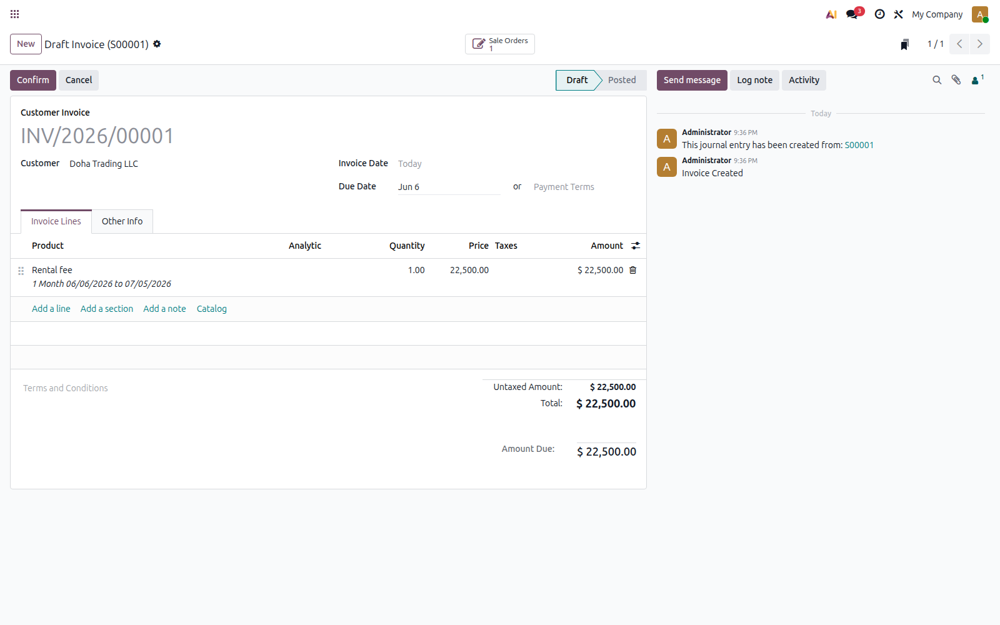

**Proves:** Invoice lifecycle visible before posting — draft state with **Amount Due** 22,500 and link to originating sale order S00001.

---

### UC-IRE-008 — Availability gantt

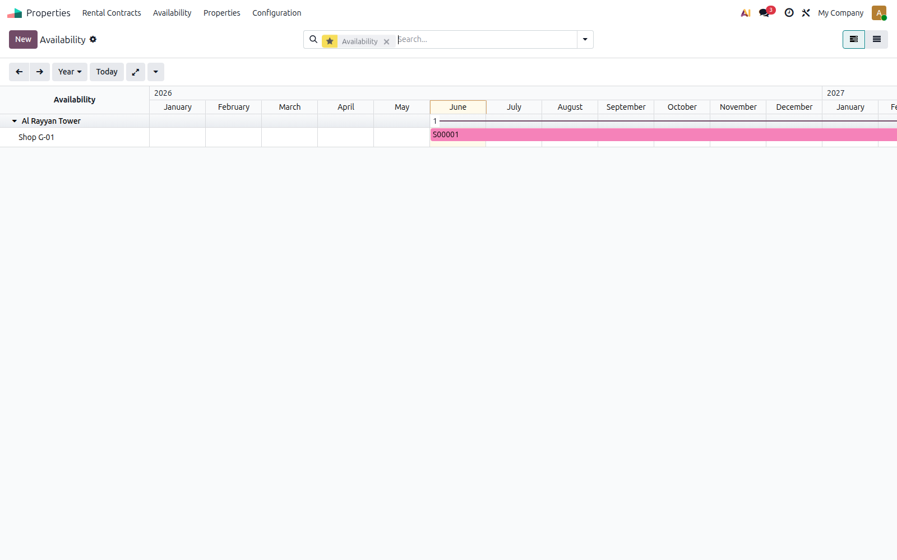

**Proves:** Native **Availability** gantt shows property occupancy by subscription contract dates. Out-of-the-box occupancy planning — not available in Phase 1 `sale_renting`.

---

### UC-IRE-008 — Properties kanban

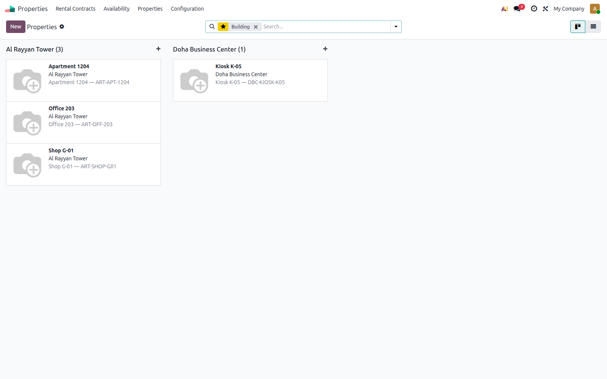

**Proves:** Property register kanban lists all units with visual cards. Serves as the operational property portfolio view until Qatar statutory register is built.

---

### UC-IRE-009 — Gap analysis (Shop G-01 fields)

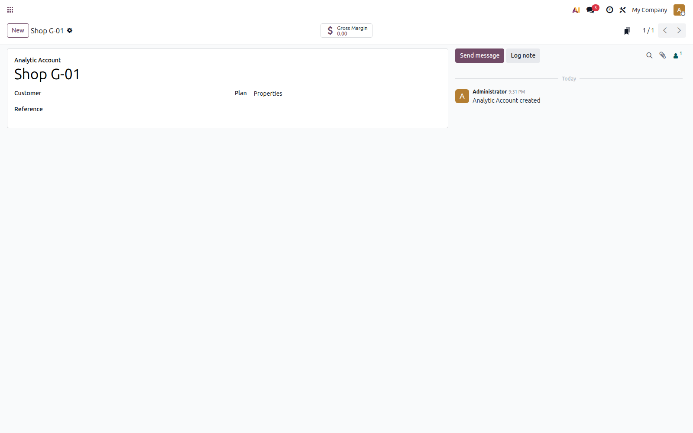

**Proves:** Native `industry_real_estate` fields are insufficient for Qatar compliance. Missing: district, zone, RERA, Baladiya, plot number, Kahramaa reference, and structured unit codes. Scope confirmed for `qatar_property_base`.

---

## User guide

A step-by-step guide for navigating the official property workflow in the UAT sandbox.

### Step 1 — Open Properties app

| | |
|---|---|
| **Menu** | App launcher → **Properties** |
| **Expected result** | Rental Contracts view opens (kanban/list of property-linked subscriptions) |
| **Screenshot** | [01_real_estate_rental_contracts.png](docs/screenshots/industry_real_estate_uat/01_real_estate_rental_contracts.png) |

### Step 2 — Open Buildings

| | |
|---|---|
| **Menu** | Properties → Properties → **Buildings** |
| **Expected result** | Kanban of all buildings (`x_buildings`) |
| **Screenshot** | [02_buildings_list.png](docs/screenshots/industry_real_estate_uat/02_buildings_list.png) |

### Step 3 — Review building details

| | |
|---|---|
| **Action** | Click a building card (e.g. Al Rayyan Tower) |
| **Expected result** | Form with name, address, city, ZIP, country |
| **Screenshot** | [02b_building_al_rayyan_form.png](docs/screenshots/industry_real_estate_uat/02b_building_al_rayyan_form.png) |

### Step 4 — Open property units

| | |
|---|---|
| **Menu** | Properties → Properties → **Properties** |
| **Expected result** | Kanban of all property units (analytic accounts on Properties plan) |
| **Screenshot** | [03_units_list.png](docs/screenshots/industry_real_estate_uat/03_units_list.png) |

### Step 5 — Open Shop G-01

| | |
|---|---|
| **Action** | Open unit **Shop G-01** |
| **Expected result** | Property form: Plan = Properties, building = Al Rayyan Tower, type = Commercial space |
| **Screenshot** | [04_shop_g01_form.png](docs/screenshots/industry_real_estate_uat/04_shop_g01_form.png) |

### Step 6 — Open or create tenant

| | |
|---|---|
| **Menu** | Contacts → open **Doha Trading LLC** |
| **Expected result** | Company partner record; used as Customer on contracts |
| **Screenshot** | [05_tenant_doha_trading_llc.png](docs/screenshots/industry_real_estate_uat/05_tenant_doha_trading_llc.png) |

### Step 7 — Create subscription contract

| | |
|---|---|
| **Menu** | Properties → **Rental Contracts** → New (or open S00001) |
| **Fields** | Property = Shop G-01, Customer = Doha Trading LLC, Recurring Plan = Monthly, Rental fee line |
| **Expected result** | Confirmed contract, status **In Progress**, MRR displayed |
| **Screenshot** | [06_contract_subscription.png](docs/screenshots/industry_real_estate_uat/06_contract_subscription.png) |

### Step 8 — Generate invoice

| | |
|---|---|
| **Action** | On confirmed contract → Create Invoice (or subscription auto-billing) |
| **Expected result** | Customer invoice INV/2026/00001, rental fee line, origin S00001 |
| **Screenshot** | [07_invoice.png](docs/screenshots/industry_real_estate_uat/07_invoice.png) |

### Step 9 — Open payment wizard

| | |
|---|---|
| **Action** | On posted invoice → click **Pay** |
| **Expected result** | Register Payment wizard opens with amount and journal |
| **Screenshot** | [08_payment_wizard.png](docs/screenshots/industry_real_estate_uat/08_payment_wizard.png) |

### Step 10 — Review availability / property reporting

| | |
|---|---|
| **Menu** | Properties → **Availability** (gantt) and Properties → **Properties** (kanban) |
| **Expected result** | Gantt shows contract occupancy timeline; kanban shows unit portfolio |
| **Screenshots** | [09_availability_gantt.png](docs/screenshots/industry_real_estate_uat/09_availability_gantt.png) · [09b_properties_kanban.png](docs/screenshots/industry_real_estate_uat/09b_properties_kanban.png) |

---

## Demo data (UAT sandbox)

Data created and validated in `qatar_property_industry_uat`:

### Buildings

| Name | Model | Purpose |
|------|-------|---------|
| Al Rayyan Tower | `x_buildings` | Primary tower — shops, offices, apartments |
| Doha Business Center | `x_buildings` | Commercial center — kiosk units |

### Property units

| Unit | Code | Building | Type |
|------|------|----------|------|
| Shop G-01 | ART-SHOP-G01 | Al Rayyan Tower | Commercial space |
| Office 203 | ART-OFF-203 | Al Rayyan Tower | Office |
| Apartment 1204 | ART-APT-1204 | Al Rayyan Tower | Appartment |
| Kiosk K-05 | DBC-KIOSK-K05 | Doha Business Center | Room |

### Tenant

| Name | Model | Role in workflow |
|------|-------|------------------|
| Doha Trading LLC | `res.partner` | Customer on subscription contract |

### Contract

| Reference | Property | Amount | Plan | Period |
|-----------|----------|--------|------|--------|
| **S00001** | Shop G-01 | 22,500 / month | Monthly | 06/06/2026 → 06/06/2027 |

### Invoice

| Reference | Origin | Amount | Status |
|-----------|--------|--------|--------|
| **INV/2026/00001** | S00001 | 22,500 | Posted (not paid in UAT) |

---

## Gap analysis — Qatar features for `qatar_property_base`

The following are **not** provided by `industry_real_estate` and are planned for the Qatar extension module:

| Gap | Planned in `qatar_property_base` |
|-----|----------------------------------|
| Qatar district | Custom field on building / unit |
| Zone | Custom field on building / unit |
| RERA reference | Regulatory reference on building / unit |
| Baladiya reference | Municipal reference on building / unit |
| Plot number | Structured plot identifier on unit |
| Kahramaa meter reference | Link to utility meter on unit |
| Owner / sponsor / guarantor roles | Partner role enhancement beyond generic Customer |
| Qatar statutory property register | Official portfolio report (PDF / list / pivot) |
| Qatar-specific reports | Lease schedules, regulatory exports |

Evidence screenshot: [10_gap_analysis_shop_g01_fields.png](docs/screenshots/industry_real_estate_uat/10_gap_analysis_shop_g01_fields.png)

---

## Future phases roadmap

| Phase | Addon | Purpose | Status |
|-------|-------|---------|--------|
| **Phase 2** | `qatar_property_base` | Qatar fields, partner roles, property register, extend official model | Planned |
| **Phase 3** | `qatar_property_reservation` | Hold units, reservation deposits, reservation expiry | Planned |
| **Phase 4** | `qatar_property_pdc` | Post-dated cheque tracking, clearing, bouncing, replacement | Planned |
| **Phase 5** | `qatar_property_rent_schedule` | Installments, escalation, renewals | Planned |
| **Phase 6** | `qatar_property_reports` | Arabic/English lease PDFs, tenant statements, owner statements | Planned |
| **Phase 7** | `qatar_property_portal` | Tenant and owner self-service portal | Planned |
| **Phase 7** | `qatar_property_kahramaa` | Kahramaa utility tracking and meter integration | Planned |

Each phase builds on the `industry_real_estate` foundation validated in this UAT branch. No phase reverts to Phase 1 `sale_renting` models.

---

## Detailed documentation

| Document | Description |
|----------|-------------|
| [docs/PHASE2_PLAN.md](docs/PHASE2_PLAN.md) | Phase 2 scope, deliverables, timeline |
| [docs/PHASE_1_5_ARCHITECTURE_DECISION.md](docs/PHASE_1_5_ARCHITECTURE_DECISION.md) | Architecture gate — Option B decision record |
| [docs/USE_CASES_INDUSTRY_REAL_ESTATE_UAT.md](docs/USE_CASES_INDUSTRY_REAL_ESTATE_UAT.md) | Full UAT use cases UC-IRE-001 … UC-IRE-009 |
| [docs/INDUSTRY_REAL_ESTATE_WORKFLOW_ANALYSIS.md](docs/INDUSTRY_REAL_ESTATE_WORKFLOW_ANALYSIS.md) | Menu structure, models, invoice/payment behaviour |
| [docs/PHASE_2_MODULE_DESIGN.md](docs/PHASE_2_MODULE_DESIGN.md) | Provisional design for `qatar_property_base` |
| [docs/screenshots/industry_real_estate_uat/](docs/screenshots/industry_real_estate_uat/) | All UAT screenshot files |

---

## Acceptance statement

> This README represents the **approved pre-development evidence** for using Odoo official `industry_real_estate` as the Qatar Property Phase 2 foundation.
>
> **Custom development (`qatar_property_base`) should start only after this UAT branch is reviewed and merged.**

| Sign-off item | Status |
|---------------|--------|
| Architecture decision (Option B) | Client approved |
| UAT scenarios UC-IRE-001 … 009 | 8 PASS · 1 PARTIAL · 0 FAIL |
| Screenshot evidence | 13 captures |
| Custom module code | None — by design |
| Phase 1 database | Untouched |

---

## Phase 1 reference

| Item | Detail |
|------|--------|
| **Repository** | https://github.com/Bright-Information-Systems/bright_property_rental_phase_1 |
| **Stack** | Native `sale_renting` (workflow validation) |
| **UAT** | 6/6 PASS · S00006 / INV/2026/00001 validated |
| **Role** | Historical reference — not the Phase 2 production model |

---

**Bright Information Systems W.L.L** · June 2026
