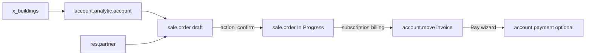

# Industry Real Estate — Workflow Analysis

**Bright Information Systems W.L.L** · Qatar Property Phase 2  
**Source module:** `industry_real_estate` v19.0.1.3 (Odoo Enterprise OEEL)  
**Sandbox:** `qatar_property_industry_uat` @ http://127.0.0.1:9020  
**Analysis date:** 6 June 2026

---

## Executive summary

Odoo’s official **Property Management** industry package (`industry_real_estate`) provides a complete rental stack built on **subscriptions** and **analytic accounts**, not on `sale_renting`. Buildings, units, contracts, recurring invoices, and availability views work out of the box. Qatar-specific registry fields, partner roles, and statutory reports are **not** included and remain the scope of future `qatar_property_base` extensions.

---

## Menu structure (actual UI)

Root app: **Properties** (`menu_root` → action Rental Contracts)

```
Properties
├── Rental Contracts      → sale.order (property-linked subscriptions)
├── Availability          → sale.order gantt (occupancy)
├── Properties
│   ├── Properties        → account.analytic.account (x_is_property=True)
│   ├── Buildings         → x_buildings
│   └── Products          → product.template (rental fee catalogue)
└── Configuration
    └── Meters            → x_meters
```

| Menu | XML action ID | DB action ID (sandbox) | Model | View modes |
|------|---------------|------------------------|-------|------------|
| Rental Contracts | `action_rental_contracts` | 608 | `sale.order` | kanban, list, form, calendar |
| Availability | `action_availability` | 609 | `sale.order` | gantt, list, form |
| Properties | `action_properties` | 610 | `account.analytic.account` | kanban, list, form |
| Buildings | `action_buildings` | 613 | `x_buildings` | kanban, form |
| Products | `action_products` | — | `product.template` | kanban, list, form |
| Meters | `action_configuration_meters` | — | `x_meters` | list |

Domain filters:
- Rental Contracts / Availability: `[('x_account_analytic_account_id', '!=', False)]`
- Properties: `[('x_is_property', '=', True)]`

---

## Models used

### Core rental chain

| Concept | Model | Key fields |
|---------|-------|------------|
| Building | `x_buildings` | `x_name`, `x_street`, `x_city`, `x_zip`, `x_country`, `x_state` |
| Unit / Property | `account.analytic.account` | `plan_id` (Properties), `x_is_property`, `x_property_building_id`, `x_property_type`, `x_property_address`, `x_is_published`, `x_rental_contract_id`, `x_invoice_status` |
| Tenant | `res.partner` | Standard customer; no tenant role |
| Contract | `sale.order` | `x_account_analytic_account_id`, `plan_id`, `start_date`, `end_date`, `subscription_state` |
| Order line | `sale.order.line` | `product_id` (*Rental fee*), `price_unit`, `product_uom_qty` |
| Invoice | `account.move` | `invoice_origin` → S00001, standard AR lines |
| Meter | `x_meters` | Configuration utility readings (not Kahramaa-specific) |

### Analytic plan

- XML ID: `industry_real_estate.analytic_plan_properties`
- Sandbox `plan_id`: 2
- Units must use this plan for `x_is_property` computation.

### Property types (selection on unit)

Native values include: `Commercial space`, `Office`, `Appartment` *(sic)*, `Room`, and others defined in `ir_model_fields.xml`.

---

## Building / unit mapping

### Phase 1 (`sale_renting`) vs industry package

| Concept | Phase 1 | `industry_real_estate` |
|---------|---------|------------------------|
| Building | `product.category` | `x_buildings` |
| Unit | `product.template` (`rent_ok`) | `account.analytic.account` (Properties plan) |
| Contract | `sale.order` (`is_rental_order`) | `sale.order` (subscription + property analytic) |
| Pricing | Product rental price | Subscription line + recurring plan |

### UAT unit mapping

| Display name | Code | Building | Type |
|--------------|------|----------|------|
| Shop G-01 | ART-SHOP-G01 | Al Rayyan Tower | Commercial space |
| Office 203 | ART-OFF-203 | Al Rayyan Tower | Office |
| Apartment 1204 | ART-APT-1204 | Al Rayyan Tower | Appartment |
| Kiosk K-05 | DBC-KIOSK-K05 | Doha Business Center | Room |

---

## Tenant / customer flow

1. Create `res.partner` (company) — **Doha Trading LLC**.
2. No native distinction between owner, tenant, sponsor, or guarantor.
3. Partner becomes tenant only when set as `partner_id` on a property-linked `sale.order`.
4. Property form may show **Customer** when `x_rental_contract_id` links an active contract.

**Gap:** Qatar lease parties (owner, sponsor, guarantor) need `qatar_property_base` partner extensions.

---

## Contract / subscription / order flow

Documented end-to-end path validated in UAT:



### Step detail

1. **Select property** — `x_account_analytic_account_id` on `sale.order` (required for Properties menu domain).
2. **Select customer** — `partner_id`.
3. **Subscription terms** — `plan_id` (e.g. Monthly), `start_date`, `end_date`.
4. **Order line** — product *Rental fee* with monthly amount (22,500 in UAT).
5. **Confirm** — `action_confirm`:
   - `state` = `sale`
   - `subscription_state` = `3_progress` (In Progress)
   - `next_invoice_date` scheduled
6. **Invoice** — `sale.advance.payment.inv` wizard or subscription automatic billing → `account.move` (`out_invoice`).
7. **Post** — `action_post` → invoice number assigned (INV/2026/00001).

**Not used:** `sale_renting`, `is_rental_order`, rental pickup/return dates, or `product.template` rent flags.

---

## Invoice / payment behavior

| Aspect | Behavior |
|--------|----------|
| Creation | Standard subscription / advance invoice wizard on confirmed `sale.order` |
| Line label | Period-based (e.g. *1 Month 06/06/2026 to 07/05/2026*) |
| Link back | `invoice_origin` = S00001; Sale Orders smart button on invoice |
| Posting | Manual or automated `action_post` |
| Payment | Standard **Pay** button → `account.payment` register wizard |
| Recurring | MRR tracked; next invoice date on contract |

UAT invoice **INV/2026/00001**: posted, 22,500, `not_paid` (payment wizard opened, not submitted).

---

## What Odoo gives out of the box

**Included:**
- Building registry (`x_buildings`)
- Property/unit registry via analytic accounts
- Subscription-based rental contracts
- Availability gantt per property
- Property kanban with images/documents support
- Meter readings model (`x_meters`)
- CRM, website, knowledge base (industry bundle)
- Recurring invoicing and MRR reporting on contracts
- Standard accounting payment flow

**Not included:**
- Qatar geographic fields (district, zone, Baladiya)
- RERA / government references
- Plot number structure
- Kahramaa meter ID on units
- Owner / sponsor / guarantor partner roles
- Arabic lease reports / Qatar property register
- PDC, reservations, rent schedules (Phase 2+ scope)

---

## What `qatar_property_base` still needs

Recommended extension approach (inherits `industry_real_estate`, does **not** depend on `sale_renting`):

| Area | Extension |
|------|-----------|
| `x_buildings` | Qatar address fields, RERA building ref, Baladiya |
| `account.analytic.account` | Plot no., zone, district, structured unit code, Kahramaa meter link |
| `res.partner` | Roles: owner, tenant, sponsor, guarantor |
| `sale.order` | Qatar lease metadata, document checklist |
| Reporting | Property register (PDF/list), pivot by district/zone |
| Meters | Kahramaa integration fields on `x_meters` or unit |

Phase 1 UAT records (S00006, S00007, INV/2026/00001 on `sale_renting`) remain **historical reference only** — not migration targets for the industry stack.

---

## Module dependencies (high level)

`industry_real_estate` depends on subscription/CRM/website stack (`project_sale_subscription`, `crm_enterprise`, `website_studio`, etc.) — **not** `sale_renting`.

Install footprint: ~136 modules (sandbox count with `--without-demo=all`).

---

## Evidence links

| Artifact | Path |
|----------|------|
| UAT use cases | [USE_CASES_INDUSTRY_REAL_ESTATE_UAT.md](USE_CASES_INDUSTRY_REAL_ESTATE_UAT.md) |
| Screenshots | [screenshots/industry_real_estate_uat/](screenshots/industry_real_estate_uat/) |
| Playwright tests | [../tests/playwright/tests/industry_real_estate_uat.spec.js](../tests/playwright/tests/industry_real_estate_uat.spec.js) |

---

**Bright Information Systems W.L.L** · June 2026
